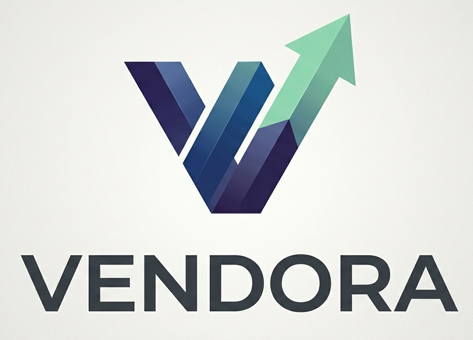

# Vendora 

Vendora is a modern, intuitive financial ecosystem designed to help individuals take absolute control over their monthly budgeting and long-term investments. By bridging the gap between daily cash flow and wealth building, Vendora gives you a clear, high-level vantage point over your net worth.

> ⚠️ **Project Status: Early Development**  
> This project is currently in its initial base phase. Core UI layouts and basic structural architecture are being actively developed.

---

## ✨ Features (Planned & In-Progress)

*   **Unified Dashboard:** View your total balance, monthly income, and monthly expenses at a glance with real-time currency calculation.
*   **Dynamic Visualizations:** Keep track of financial trends via comprehensive "Income vs. Expenses" historical bar charts and "Spending by Category" breakdowns.
*   **Granular Budgeting:** Set strict monthly category budgets (Food, Transport, Utilities, Entertainment) to prevent mindless spending.
*   **Investment Tracking:** A dedicated space to route your surplus cash flow directly into portfolios, tracking assets and long-term yields.
*   **Transaction Ledger:** Quick transaction management to log, categorize, and audit every incoming and outgoing euro.

---

## 🛠️ Technology Stack

* **Backend Framework:** PHP 8.2 with Laravel 10 (Robust MVC architecture handling authentication, budgeting endpoints, and portfolio math)
* **Frontend Framework:** Angular (TypeScript-driven SPA handling the dynamic dashboard state, modular budget components, and strict data typing)
* **Styling:** Tailwind CSS (For the modern, responsive clean dashboard UI)
* **Data Visualization:** Chart.js
* **Database:** MySQL (Structured data storage for relational users, categories, transactions, and holdings)

---

## 🚀 Getting Started

To get a local copy up and running, follow these simple steps.

### Prerequisites

To run this project locally, ensure you have the following environments and tools installed on your system:

*   **PHP:** Version 8.2
*   **Composer:** Dependency manager for PHP (to install Laravel packages)
*   **Node.js & npm:** Node.js (LTS version recommended) and npm (required to manage and build the Angular frontend)
*   **MySQL Server:** Version 8.0 or higher (to host the relational database for users, budgets, and transactions)
