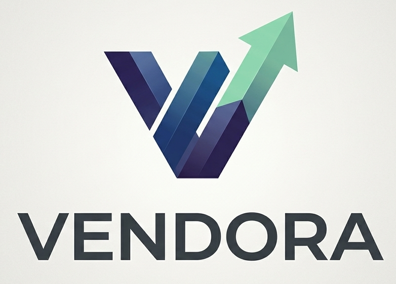

# Vendora 

Vendora is a modern, intuitive financial ecosystem designed to help individuals take absolute control over their monthly budgeting and long-term investments. By bridging the gap between daily cash flow and wealth building, Vendora gives you a clear, high-level vantage point over your net worth.

> ⚠️ **Project Status: Early Development**  
> This project is currently in its initial base phase. Core UI layouts and basic structural architecture are being actively developed.

---

## ✨ Features (Planned & In-Progress)

*   **Unified Dashboard:** View your total balance, monthly income, and monthly expenses at a glance with real-time currency calculation.
*   **Dynamic Visualizations:** Keep track of financial trends via comprehensive "Income vs. Expenses" historical bar charts and "Spending by Category" breakdowns.
*   **Granular Budgeting:** Set strict monthly category budgets (Food, Transport, Utilities, Entertainment) to prevent mindless spending.
*   **Investment Tracking:** A dedicated space to route your surplus cash flow directly into portfolios, tracking assets and long-term yields.
*   **Transaction Ledger:** Quick transaction management to log, categorize, and audit every incoming and outgoing euro.

---

## 🛠️ Technology Stack

* **Backend Framework:** PHP 8.5 with Laravel 10 (robust MVC architecture handling authentication, budgeting endpoints, and portfolio math)
* **Frontend Framework:** Angular (TypeScript-driven SPA handling the dynamic dashboard state, modular budget components, and strict data typing)
* **Styling:** Tailwind CSS (For the modern, responsive clean dashboard UI)
* **Data Visualization:** Chart.js
* **Database:** SQLite by default, with optional MySQL (structured data storage for relational users, categories, transactions, and holdings)

---

## 🚀 Getting Started

To get a local copy up and running, follow these simple steps.

### Prerequisites

To run this project locally, ensure you have the following environments and tools installed on your system:

*   **PHP:** Version 8.5
*   **Composer:** Dependency manager for PHP (to install Laravel packages)
*   **Node.js & npm:** Node.js LTS and npm (required to manage and build the Angular frontend)
*   **SQLite:** Default local database (or MySQL 8.0+ if preferred)

### Ubuntu / Linux setup

1. Install PHP and required extensions:

```bash
sudo apt update
sudo apt install -y php8.5-cli php8.5-curl php8.5-mbstring php8.5-xml \
  php8.5-zip php8.5-bcmath php8.5-sqlite3 php8.5-mysql php8.5-gd \
  php8.5-intl unzip sqlite3
```

2. Install Composer:

```bash
php backend/composer-setup.php --install-dir=/usr/local/bin --filename=composer
```

3. Install Node.js (LTS):

```bash
curl -fsSL https://deb.nodesource.com/setup_22.x | sudo -E bash -
sudo apt install -y nodejs
```

4. Optional: install MySQL if you want to use MySQL instead of SQLite:

```bash
sudo apt install -y mysql-server
sudo mysql_secure_installation
```

### Install and run

Start the backend:

```bash
cd backend
cp .env.example .env
php artisan key:generate
composer install
touch database/database.sqlite
php artisan migrate
php artisan serve
```

Then, in a new terminal, start the frontend:

```bash
cd frontend
npm install
npm start
```

The backend runs at `http://localhost:8000` and the frontend at `http://localhost:4200`.
